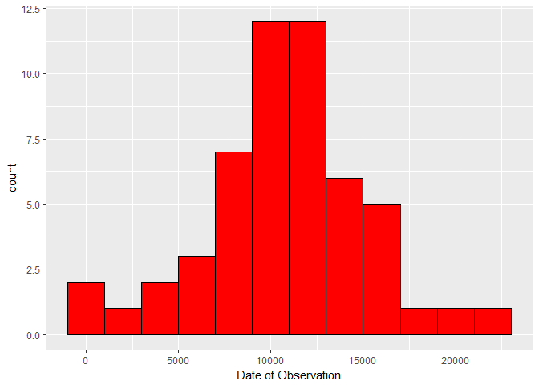
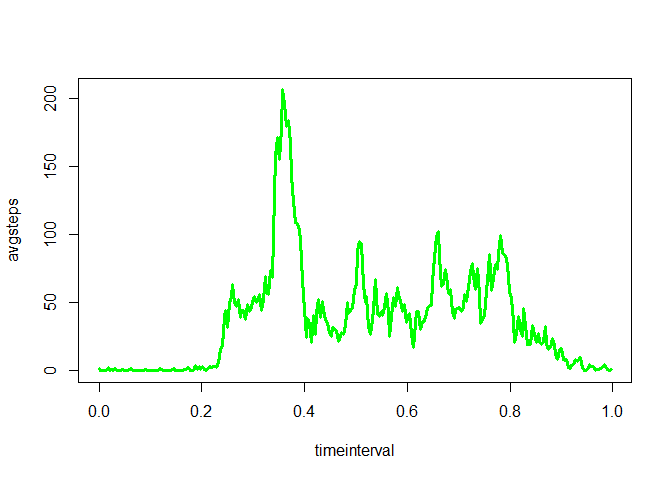
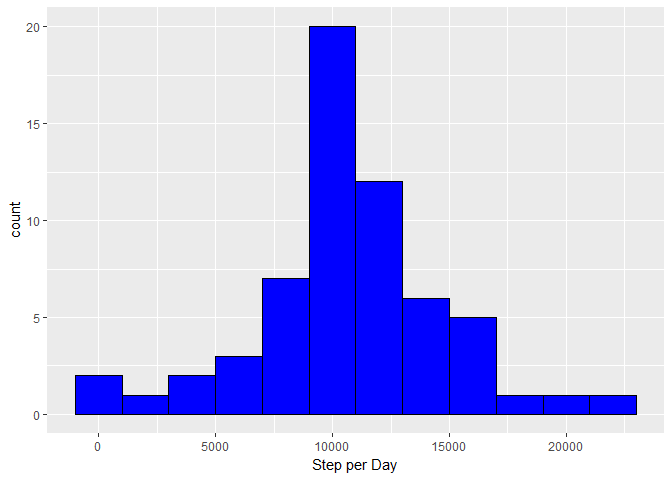
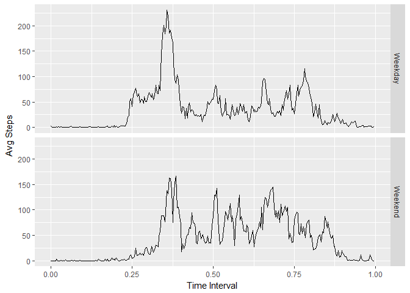

RepData Assignment
================
Ira Lowe
March 27, 2017

Assignment Commit containing full submission All of the R code needed to reproduce the results (numbers, plots, etc.) in the report

1.  Code for reading in the dataset and/or processing the data
2.  Histogram of the total number of steps taken each day
3.  Mean and median number of steps taken each day
4.  Time series plot of the average number of steps taken
5.  The 5-minute interval that, on average, contains the maximum number of steps
6.  Code to describe and show a strategy for imputing missing data
7.  Histogram of the total number of steps taken each day after missing values are imputed
8.  Panel plot comparing the average number of steps taken per 5-minute interval across weekdays and weekends

Reading and processing the data
-------------------------------

-   Read data csv file
-   Transform date from factor to date format
-   Transform interval to times format
-   Remove missing values from data

``` r
library(ggplot2)
```

    ## Warning: package 'ggplot2' was built under R version 3.3.3

``` r
library(dplyr)
```

    ## 
    ## Attaching package: 'dplyr'

    ## The following objects are masked from 'package:stats':
    ## 
    ##     filter, lag

    ## The following objects are masked from 'package:base':
    ## 
    ##     intersect, setdiff, setequal, union

``` r
# library(plyr)
library(chron)
setwd("C:/Users/gatom/Coursera/Reproduce/Project1")

proj1 <- read.csv("activity.csv")


proj1$obsdate = as.Date(proj1$date)


x <- rep(seq(0,55,5),times=24)
z <- rep(c(0),times=288) 
y <- rep(0:23,each=12) 
timeinterval <- paste(y,x,z,sep=':')
timeinterval1 <- rep(timeinterval, times= 61)
timeinterval2 <- times(timeinterval1)
proj1$timeinterval <- timeinterval2
proj1a <- na.omit(proj1)
```

Calculate total steps taken each day and create a hisogram
----------------------------------------------------------

-   plot warning indicates 8 days with no data

``` r
projsumday <- proj1 %>%
  group_by(obsdate) %>%
  select(steps, obsdate,date,interval) %>%
  summarise (totsteps = sum(steps) )

ggplot(data=projsumday, aes(totsteps)) +
  geom_histogram(binwidth=2000 ,color='black', fill ='red') + 
    xlab("Date of Observation") 
```

    ## Warning: Removed 8 rows containing non-finite values (stat_bin).



Mean and Median of Steps each day
---------------------------------

``` r
projmeanday <- projsumday %>%
  select(obsdate, totsteps) %>%
    summarise (meanstep = mean(totsteps, na.rm=TRUE)
               ,mediansteps = median(totsteps, na.rm=TRUE) )
projmeanday
```

    ## # A tibble: 1 × 2
    ##   meanstep mediansteps
    ##      <dbl>       <int>
    ## 1 10766.19       10765

Time series of aveage steps taken by interal for all days
---------------------------------------------------------

the interval shown is the fractional part of the day in 5 minute increments

``` r
projinterval <- proj1a %>%
  select(timeinterval, steps, obsdate, date) %>%
  group_by (timeinterval)  %>% 
  summarise (avgsteps = mean(steps))

 with(projinterval, plot(avgsteps ~ timeinterval ,
                    type= "l" , col='green', lwd =3))
```



Interval with the highest average steps
---------------------------------------

``` r
subset(projinterval, avgsteps ==max(avgsteps))
```

    ## # A tibble: 1 × 2
    ##   timeinterval avgsteps
    ##    <S3: times>    <dbl>
    ## 1     08:35:00 206.1698

Inputing missing data
---------------------

-   create logical vector of missing observations
-   calculate percent missing
-   create dataframe of missing data
-   merge missing data frame with data frame containing averge steps by interval for all days
-   create dataframe of missing data to be appended to original data without missing

``` r
miss1 <- is.na(proj1$steps)
mean(miss1)
```

    ## [1] 0.1311475

``` r
projmissing <- proj1[miss1,]


intmissing <- merge(projmissing, projinterval, by='timeinterval')

intmissing1 <- data.frame(steps = intmissing$avgsteps, date =intmissing$date,
                         interval = intmissing$interval,
                         obsdate = as.Date(intmissing$date),
                          timeinterval = intmissing$timeinterval)                 
proj1miss <- rbind(proj1a, intmissing1)
```

Histogram of total steps with imputed data
------------------------------------------

recalculte averages mean and median plot data

``` r
proj1miss1 <- arrange(proj1miss,obsdate,timeinterval)

projsumdaym <- proj1miss1 %>%
  group_by(obsdate) %>%
  select(steps, obsdate,date,interval) %>%
  summarise (totsteps = sum(steps) )

projmeandaym <- projsumdaym %>%
  select(obsdate, totsteps) %>%
  summarise (meanstep = mean(totsteps) ,mediansteps = median(totsteps) )
projmeandaym
```

    ## # A tibble: 1 × 2
    ##   meanstep mediansteps
    ##      <dbl>       <dbl>
    ## 1 10766.19    10766.19

``` r
ggplot(data=projsumdaym, aes(totsteps)) +
  geom_histogram(binwidth = 2000 ,color='black', fill ='blue') + 
  xlab("Step per Day")  
```

 \#\# Panel Plot Avg steps by interval Weekday and Weekend - mutate new variable DayofWeek by using weekdays() funtion - calculate average steps by ineterval by DayofWeek - panel plot results

``` r
mtf<- c('Monday', 'Tuesday',
             'Wednesday', 'Thursday' ,'Friday')
ss <- c('Saturday', 'Sunday')

weekday <- weekdays(proj1miss1$obsdate) %in% mtf
weekend <- weekdays(proj1miss1$obsdate) %in% ss


projdayofweek <-mutate(proj1miss1,
                       DayofWeek = ifelse(weekdays(proj1miss1$obsdate) %in% mtf , 
                'Weekday', 'Weekend'))    

projsumdow <- projdayofweek %>%
  select(steps, obsdate,date,timeinterval,DayofWeek) %>%
    group_by(DayofWeek, timeinterval) %>%
  summarise (avgsteps= mean(steps))

ggplot(data=projsumdow, aes(timeinterval, avgsteps))  +
  facet_grid(DayofWeek ~ .)  +     
  geom_line() +
  xlab("Time Interval") +
  ylab("Avg Steps")
```

    ## Don't know how to automatically pick scale for object of type times. Defaulting to continuous.


